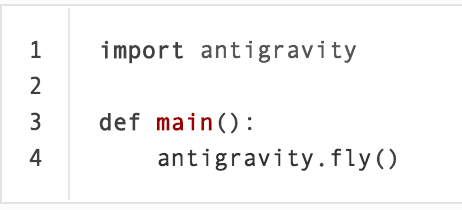
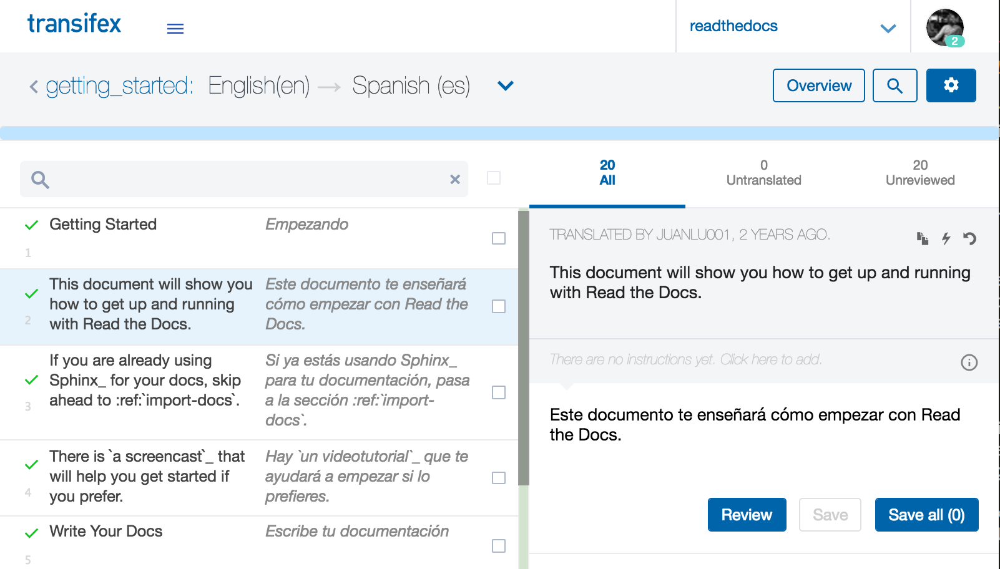

An introduction to Sphinx and Read the Docs for Technical Writers
=================================================================

By: Eric Holscher

Bio: Eric Holscher is the co-founder of Read the Docs, and the Write the Docs conference.
Along with community organizing and open source work,
he does consulting around software documentation and speaks at a number of industry events each year.
When he isn't expressing his views on software docs, he's getting views from the top of mountains.

Treating documentation as code is becoming a major theme in the software industry.
This is coming from both sides,
with developers starting treat documentation as a priority alongside tests and code,
and writers seeing a lot of value in integrating more into the development process.
This marrying of cultures isn't simple,
but having the proper tools for the job makes both sides happy with the results that get produced.

A lot of developer tools don't work well for writers.
Sphinx and Read the Docs unique in this ecosystem,
in that they have powerful tools that both writers and developers want,
in one convenient package.

Overview of the Ecosystem
-------------------------

Read the Docs is the largest open source documentation hosting site in the world.
Open Source in this context means both that the code is open source,
and the documentation hosted is for open source software.
It is a developer focused platform,
but it has most of the features that technical writers have come to expect in a tool as well.
This blending of worlds makes it the best suited platform for teams that want both writers and developers contributing to product and API documentation.

Read the Docs is best thought of as a continuous documentation platform for Sphinx.
Continuous documentation being similar to continuous integration in programming circles.
In practice it means that your documentation is built,
tested, 
and updated on every commit.

Sphinx provides a documentation generator that is best-in-class for software docs.
Sphinx documents are written in the reStructuredText markup language.
which is similar to Markdown,
but much more powerful.
Read the Docs provides a best-in-class hosting platform for Sphinx.

As a writer who uses Sphinx,
your day to day will be writing reStructuredText in text files.
You will then build your documentation by running Sphinx on the command line.
Generally it's easiest to output HTML for local writing and testing,
and then you can let Read the Docs generate PDF's and other formats.

This article will provide an overview of the features of Sphinx and Read the Docs,
and allow you to evaluate them for use in your organization.

Introduction to Sphinx
----------------------

`Sphinx <http://www.sphinx-doc.org/>`_ is the documentation tool of choice for the Python language community,
and increasingly large parts of the software ecosystem.
It was `originally created <https://en.wikipedia.org/wiki/Sphinx_(documentation_generator)>`_ in 2008 to document the Python language itself.

Over the past eight years,
it has turned into a robust and mature solution for software documentation.
It has a number of features that technical writers would expect,
including:

* Single Source Publishing 
    * Output HTML, PDF, ePub, and more
    * Content reuse through includes
    * Conditional includes based on content type and tags
* Multiple mature HTML themes that look beautiful on mobile and desktop
* Referencing across pages, documents, and projects
* Index and Glossary support
* Internationalization support

It also has practical and powerful tools for documenting software specifically,
including:

* Semantic referencing of software concepts, including Classes, Functions, Programs, Variables, etc.
* Including of code comments inside prose documentation for many programming languages
* Tools for documenting HTTP API's
* Extensions with the Python language
* A vast array of third party extensions to do useful things

This article isn't large enough to cover all of the power packed into this tool.
Hopefully I can show you enough that it piques your interest and you can research more.

Using Sphinx
~~~~~~~~~~~~

reStructuredText is a powerful language primarily because the syntax can be extended.
There are two types of extension that reStructuredText supports:

* Paragraph level (with Directives)
* Inline level (with Interpreted Text Roles, or roles for short)

Paragraph Level Markup
``````````````````````

Let's see a basic example of a *Directive* in reStructuredText::

    .. warning:: Here be dragons! This topic covers a number of options that
       might alter your database.

       Proceed with caution!

    .. figure:: screenshot-control-panel.jpg
       :width: 50%

       An overview of the admin control panel.

Here ``warning`` acts as the name of the directive,
and is the part you can extend for custom directives.
In the ``figure``,
``screenshot-control-panel.jpg`` is an *argument*,
``:width:`` is an *option*,
and the rest is the *content*
They allow for customization of directives,
and show the full power of reStructuredText.

.. note:: You'll notice that Sphinx uses whitespace to denote where a directive ends.
   This means the content will last until the next unindented line.

Sphinx ships with a number of powerful directives,
and you can also write your own if you have someone on your team that knows Python.

Inline Markup
`````````````

For extendability inside of your prose Sphinx uses roles.
Here is an example:

    You can learn more about this in :rfc:`1984`.
    It is implemented in our code at :class:`System.Security`

Here you can see ``rfc`` and ``class`` act as the name of the role,
and then you can pass in a single argument.
For the ``rfc`` role,
it will generate a link to the online reference for RFC 1984 with a text of ``RFC 1984``.

The ``class`` is where things get interesting.
This acts as a reference to the class ``System.Security`` that is documented in your project,
which will be a hyperlink in the HTML output,
but also a working link in PDF and other outputs as well.

Similarly,
you can implement your own roles with Python.
This allows you to create powerful semantic constructs into the actual *markup* you're using to write documentation.

Now,
let's see how you take these sets of reStructuredText files and turn them into a document set.

Table of Contents Tree
----------------------

One of the main concepts in Sphinx is that it allows multiple pages to be combined into a cohesive hierarchy.
The ``toctree`` directive is a fundamental part of this structure.

.. code-block:: rst

  .. toctree::
     :maxdepth: 2

     install
     support

The above example will output a Table of Contents in the page where it occurs.
The ``maxdepth`` argument tells Sphinx to include 2 levels of headers in it's output.
It will output the 2 top-level headers of the pages listed.
This also tells Sphinx that the other pages are sub-pages of the current page,
creating a "tree" structure of the pages::

    index
    ├── install
    ├── support

The TOC Tree is also used for generating the global navigation inside of Sphinx.
The `index` at the top of your project acts as the root of the navigation.
The ``toctree`` is quite important,
and one of the most powerful concepts in Sphinx.

More info on the ``toctree`` can be found here:

* http://www.sphinx-doc.org/en/stable/markup/toctree.html

Working with Code
`````````````````

Showing code examples is a common task in all documentation.
Sphinx is quite well prepared for this task.
Let's see how we can show a basic code example::

    .. code-block:: python
       :linenos:

       import antigravity

       def main():
           antigravity.fly()

This would display the Python snippet,
syntax highlighted,
with line numbers.
The ``python`` in the above example is an argument to the ``code-block`` *directive*.
The ``:linesnos:`` is an *option* that says to display line numbers for the code block.
In the HTML output,
it would look like this:



Sphinx doesn't stop there though.
It allows you to store your code examples in external files,
and be included in your documentation for easier maintenance.
This uses the ``literalinclude`` directive::

    .. literalinclude:: example.rb
       :language: ruby
       :emphasize-lines: 12,15-18

The neat thing here is the ``:emphasize-lines:``.
This will show the lines highlighted in your output.
This is quite useful for showing sets of code examples where a subset of the code changes.
You can also specify just a subset of lines to show with the ``:lines:`` option,
so you don't have to manage multiple snippets.

These directives have a lot more powerful options than I can show in this article.
You can see the full documentation for them on the Sphinx website:

* http://www.sphinx-doc.org/en/stable/markup/code.html

Working with References
```````````````````````

A powerful reference system is a large part of the power of Sphinx.
You are able to reference arbitrary headings and paragraphs in your content,
but also semantically reference a large number of things as well.
On top of that,
Sphinx includes ``intersphinx`` which allows referencing across Sphinx projects.
This means that if you have multiple projects inside your company,
you can still use semantic referencing across them!

A simple reference is defined as such::

    .. _reference-target-name::

    This is a bit of content.

    This is how you point to the above reference, :ref:`reference-target-name`

Sphinx also includes a number of other semantic reference types.
Here are a few examples:

* ``:doc:`` for referencing documents
* ``:cls:`` for referencing programming classes
* ``:term:`` for referencing glosary terms

All references support ``intersphinx``,
which allows you to prefix your references with a specific project name.
So if your user guide needs to reference your API documentation,
you could do::

    Check out the :cls:`api-ref:api.request`

Which would know to look in your ``api-ref`` project for the class.
The name ``api-ref`` is arbitrary,
and is defined in your project configuration's ``intersphinx_mapping``.

You see the complete set of references in the Sphinx documentation:

* Cross Referencing Syntax - http://www.sphinx-doc.org/en/stable/markup/inline.html#cross-referencing-syntax
* Intersphinx - http://www.sphinx-doc.org/en/stable/ext/intersphinx.html

Including comments form source code
```````````````````````````````````
Integration with software is one of the largest benefits of Sphinx.
You can easily embed software comments from multiple languages,
including Python, Java, and .Net.

Here is an example of embedding Python documentation for a class in your project::

    Make a request
    --------------

    You can make requests using the :func:`api.request` module.
    It makes HTTP requests against our website.
    Here is the basic function signature:

    .. autofunction:: api.request

As you can see,
you can include prose content along with generated content in the same file.
This allows for building a narrative around generated code comments,
instead of giving your users a separate User Guide and API Reference,
which is often times just a alphabetical listing of code!

Documentation is best written by humans.
Pulling comments from source code is valuable,
but it should be a small part of a proper set of documentation.

You can read more about including code comments in the following documentation pages:

* Domains, where the references are defined - http://www.sphinx-doc.org/en/stable/domains.html#what-is-a-domain
* Autodoc, which generates docs from Python code - http://www.sphinx-doc.org/en/stable/ext/autodoc.html
* Breathe, which bridges Doxygen and Sphinx - https://breathe.readthedocs.io/en/latest/
* AutoAPI, which bridges .Net and Sphinx - https://sphinx-autoapi.readthedocs.io/en/latest/

Tables
------

Working with tables can be the bane of anyone who uses plaintext markup languages.
Most other languages require that you write them in the file with some arcane syntax.
However with reStructuredText,
you can use directives to make this much easier.

It comes with two powerful list directives,
``csv-table`` and ``list-table``.
Here is an example of ``csv-table``::

    .. csv-table:: Frozen Delights!
       :header: "Treat", "Quantity", "Description"
       :widths: 15, 10, 30

       "Albatross", 2.99, "On a stick!"
       "Popcorn", 1.99, "Straight from the oven"

This shows the inline markup,
however the CSV can also be managed in an external file.
This allows you to manage your complex tables in a third party tool,
and have your documentation consume them from a CSV which is a much nicer workflow.

Internationalization
--------------------

Sphinx has support for translating documentation into multiple languages.
Since sphinx knows the structure of your documents,
it is able to generate a catalog of content split by each paragraph.

Sphinx internationalization works using the *gettext* system.
It ships with a builder that allows you to generate a catalog::

    make gettext

You can then use that catalog as the base translation,
using any tool that supports gettext.
I recommend using Transifex,
which gives you a web-based system for translating the documentation:



You can then tell Sphinx what language to generate for it's documentation when you build it by setting the ``language`` setting.
Read the Docs also supports translation,
allowing you to specify the language of the documentation.

More information on Sphinx internationalization can be found here:

* http://www.sphinx-doc.org/en/stable/intl.html
* http://docs.readthedocs.io/en/latest/localization.html

My blog
-------

Sphinx is quite versatile,
which means you can use it for lots of different things.
I use a package called ``ablog`` for hosting of my blog over at http://ericholscher.com.

The simplest thing you do is specify that a document is a blog post with the ``post`` directive::

    .. post:: 2016-03-15 09:00:00
       :tags: earth, love, peace

This will then add it to the set of posts that get output in any document where you use::

    .. postlist:: 
       :tags: Manual

You can even create specific archive pages for categories or tags with ``postlist``,
or just output all of your posts.

This shows some of the magical things you can do with Sphinx's extensibility.

Custom builders
---------------

Along with the basic output formats,
Sphinx also supports custom builders that do other tasks.
This is a place where you can really be creative,
and folks in the community have been.

For example,
these are a sampling of the builders that ship with Sphinx:

* A linkcheck builder that will tell you about broken URL's
* A builder that outputs all the things changed in the latest version of your code for a changelog
* An XML builder that will output a representation of your documents in XML
* A Man page builder that builds man pages from your documentation
* JSON builder that will output your pages as HTML inside of JSON, with some metadata, for embedding dynamically

Trade offs with Sphinx
----------------------

Every tool has it's issues and limitations.
I'd like to address some of the major issues with Sphinx,
so that you can go into using it with eyes wide open.

The biggest issue is that it is originally a *programmer tool*.
This means that a lot of the designs assume knowledge of code,
especially for installation and extending the tools.
Knowledge of the command line is definitely required.

The markup language,
reStructuredText,
is also a bit finicky.
It depends on whitespace for separation of content,
which is a natural concept for Python programmers,
but not for most writers.

In general though,
a lot of the complexity in the language comes from the extensibility and power.
When compared to something like Markdown,
reStructuredText can do so much more that it's worth the complexity and somewhat steep learning curve.

Introduction to Read the Docs
-----------------------------

Read the Docs is a hosting platform for Sphinx documentation.
It takes the powerful tool that Sphinx is,
then adds understanding of version control and other powerful features on top.

Supporting Git, Mercurial, and Subversion,
Read the Docs will pull down the code from your version control,
then build and host that documentation for you.
We'll use GitHub in this example as it's the most commonly used system for accessing code.

To get started,
you create a Read the Docs account,
and link your GitHub account.
Then you select the GitHub repository you'd like to build documentation for,
at which point the magic happens.

Read the Docs will:

* Clone your repository
* Build HTML, PDF, and ePub versions of your documentation from your ``master`` branch.
* Indexes your documentation to allow full-text-search
* Creates Version objects from each *tag* and *branch* in your repository, allowing you to optionally host those as well
* Activates a webhook on your repository, so when you push code to any branch, your documentation will be rebuilt

Now,
whenever you commit new code or documentation to your repository,
your documentation will be kept up to date.
This works with your ``master`` branch,
as well as any other branches or tags you might have activated documentation for.

Read the Docs has two special versions:

* ``latest`` which maps to the most up to date development version of your software
* ``stable`` which maps to the latest tagged release of your software

These are version aliases that are meant to maintain stable URL's for your users who want to use the most up to date committed or released software, respectively.

We built Read the Docs to be "set it and forget it".
Once you set your project up and activate the versions you want hosted,
we sit downstream of your version control system and just keep your documentation up to date.
It feels pretty magical once it's set up,
and takes the thankless task of deploying documentation out of your day.

Recommended Versioning System
~~~~~~~~~~~~~~~~~~~~~~~~~~~~~

Read the Docs only works with version control.
This means that however you version your software,
your documentation will follow suite.
This is great for integrating with your development team,
but it also means you need to think about the proper strategy for versioning.

If you work on a SaaS product,
you probably only have one version.
However,
if you produce software with multiple supported versions,
we recommend the following:

* A ``master`` branch that the next release of your software is developed on
* Git *branches* for ongoing maintenance of each version of your software that is maintained
* Git *tags* for specific released versions that users might be using

We recommend release branches because it allows you to update them over time.
Git *tags* are static,
so they are appropriate for specific versions that a user might have installed.

An example:

* ``master`` is your 2.2 release that isn't out yet
* ``2.1.X`` is your release branch for the ``2.1`` version
* ``2.1.0`` is a tag of your ``2.1`` branch, when you release ``2.1.0`` to your users
* ``2.1.1`` is a similar tag of your ``2.1`` branch
* ``1.4.X`` is the latest release branch of your ``1.X`` version
* ``1.4.3`` is the latest release of your ``1.X`` version

Additional Read the Docs features
~~~~~~~~~~~~~~~~~~~~~~~~~~~~~~~~~

As a hosting platform Read the Docs does add some additional features.
Here is a short list which you can explore in more detail:

* GitHub, BitBucket, and Gitlab post-commit hooks
* Custom domain hosting (CNAME's)
* Full-text search for all your projects versions
* Status badges to show your docs are up to date
* Hosting of multiple languages for a specific project
* Hosting of multiple projects on a single domain with "subprojects"

Feel free to email me or find me at a conference if you want to talk more about these things,
or have ideas for other neat features.

Real Life Examples
------------------

Read the Docs has a large number of users across many different programming languages.
This is in part because Sphinx is such a powerful and dynamic tool,
and Read the Docs makes it easy and free to host docs for your open source project.

Here are some examples that show the wide range of projects using Sphinx & Read the Docs:

* Julia - A language for scientific computing: http://docs.julialang.org
* Asp.Net - Microsoft's web framework: https://docs.asp.net
* Jupyter - An interactive programming environment: http://jupyter.readthedocs.io
* PHPMyAdmin - A web-based database editor: https://docs.phpmyadmin.net
* Write the Docs - The community site for Write the Docs - http://www.writethedocs.org

As you can see,
a wide range of projects are using the tools for many different uses.
It's a powerful tool for writing prose as well as documenting source code.

Conclusion
----------

Sphinx is an incredibly powerful tool.
Read the Docs builds on top to provide a way of hosting that documentation where it is kept up to date across versions.
Together,
they are a wonderful set of tools that developers and technical writers both enjoy using.

I firmly believe that the more integrated with the product development process technical writers get,
the better our products get.
Using tools that integrate with development workflows makes it much easier to become a part of the product process.
Sphinx and Read the Docs have been battle tested by hundreds of thousands of open source developers for years,
and are a great choice for your software documentation project.


